# PictRuby

Photo editor that can write a filter in Ruby.

You can make your special filter using Ruby. Many sample filters are also available.

Let's create your favorite picture by combining a filter.

## Installation

AppStore (in review)

## Editor

## Sample Filters

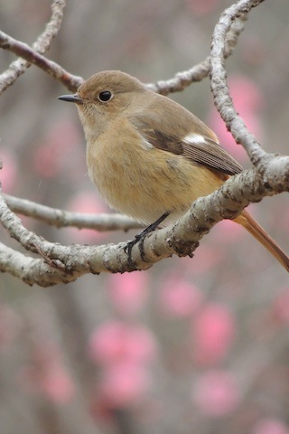

### all_filter.rb

[all_filter.rb](https://github.com/ongaeshi/PictRuby/blob/master/resources/sample/all_filter.rb)

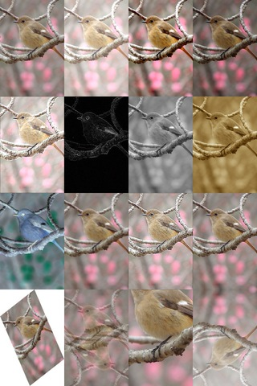

### edge.rb

[edge.rb](https://github.com/ongaeshi/PictRuby/blob/master/resources/sample/edge.rb)

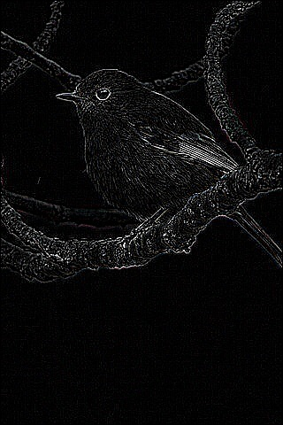

### emboss.rb

[emboss.rb](https://github.com/ongaeshi/PictRuby/blob/master/resources/sample/emboss.rb)

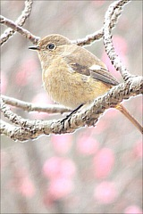

### gray.rb

[gray.rb](https://github.com/ongaeshi/PictRuby/blob/master/resources/sample/gray.rb)

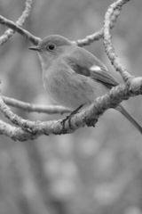

### grid.rb

[grid.rb](https://github.com/ongaeshi/PictRuby/blob/master/resources/sample/grid.rb)

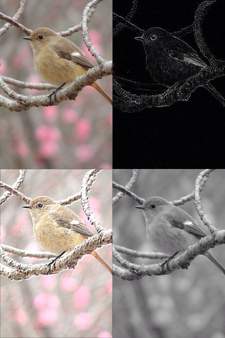

### half_gray.rb

[half_gray.rb](https://github.com/ongaeshi/PictRuby/blob/master/resources/sample/half_gray.rb)

### horizontal.rb

[horizontal.rb](https://github.com/ongaeshi/PictRuby/blob/master/resources/sample/horizontal.rb)

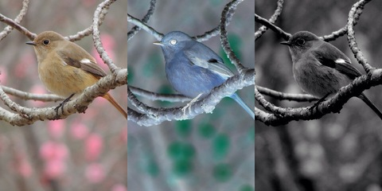

### invert.rb

[invert.rb](https://github.com/ongaeshi/PictRuby/blob/master/resources/sample/invert.rb)

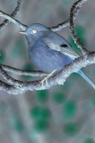

### none.rb

[none.rb](https://github.com/ongaeshi/PictRuby/blob/master/resources/sample/none.rb)

### resize_half.rb

[resize_half.rb](https://github.com/ongaeshi/PictRuby/blob/master/resources/sample/resize_half.rb)

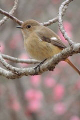

### rich_gray.rb

[rich_gray.rb](https://github.com/ongaeshi/PictRuby/blob/master/resources/sample/rich_gray.rb)

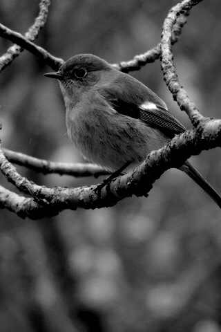

### sepia.rb

[sepia.rb](https://github.com/ongaeshi/PictRuby/blob/master/resources/sample/sepia.rb)

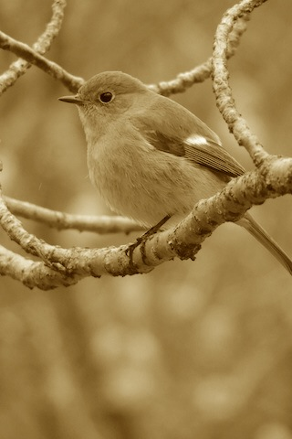

### vertical.rb

[vertical.rb](https://github.com/ongaeshi/PictRuby/blob/master/resources/sample/vertical.rb)

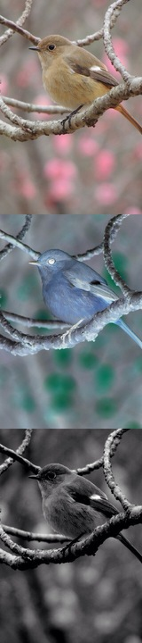

## Link

- [GitHub](https://github.com/ongaeshi/PictRuby)
