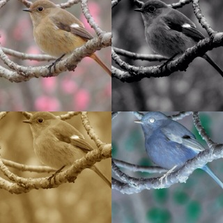
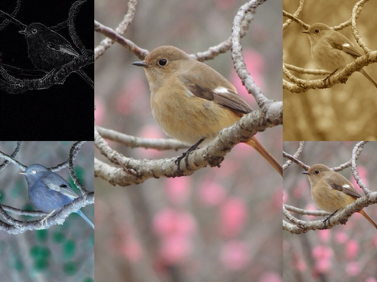
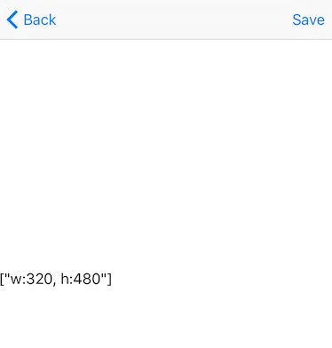

# PictRuby

iOS Photo Editor that can write a filter in Ruby.

You can make your special filter using Ruby. Many sample filters are also available.

Let's create your favorite picture by combining a filter.

## Installation

## Editor

## Link

- [GitHub](https://github.com/ongaeshi/PictRuby)

## Sample Filters

- [All Filter](#all-filter)
- [Edge](#edge)
- [Emboss](#emboss)
- [Gray](#gray)
- [Grid](#grid)
- [Grid Square](#grid-square)
- [Half Gray](#half-gray)
- [Horizontal](#horizontal)
- [Horizontal Center](#horizontal-center)
- [Invert](#invert)
- [None](#none)
- [Resize Half](#resize-half)
- [Resize Quarter](#resize-quarter)
- [Rich Gray](#rich-gray)
- [Sepia](#sepia)
- [Size](#size)
- [Vertical](#vertical)
- [Vertical Center](#vertical-center)

### All Filter

[all_filter.rb](https://github.com/ongaeshi/PictRuby/blob/master/resources/sample/all_filter.rb)

### Edge

[edge.rb](https://github.com/ongaeshi/PictRuby/blob/master/resources/sample/edge.rb)

### Emboss

[emboss.rb](https://github.com/ongaeshi/PictRuby/blob/master/resources/sample/emboss.rb)

### Gray

[gray.rb](https://github.com/ongaeshi/PictRuby/blob/master/resources/sample/gray.rb)

### Grid

[grid.rb](https://github.com/ongaeshi/PictRuby/blob/master/resources/sample/grid.rb)

### Grid Square

[grid_square.rb](https://github.com/ongaeshi/PictRuby/blob/master/resources/sample/grid_square.rb)

### Half Gray

[half_gray.rb](https://github.com/ongaeshi/PictRuby/blob/master/resources/sample/half_gray.rb)

### Horizontal Center

[horizontal_center.rb](https://github.com/ongaeshi/PictRuby/blob/master/resources/sample/horizontal_center.rb)

### Invert

[invert.rb](https://github.com/ongaeshi/PictRuby/blob/master/resources/sample/invert.rb)

### None

[none.rb](https://github.com/ongaeshi/PictRuby/blob/master/resources/sample/none.rb)

### Resize Half

[resize_half.rb](https://github.com/ongaeshi/PictRuby/blob/master/resources/sample/resize_half.rb)

### Resize Quarter

[resize_quarter.rb](https://github.com/ongaeshi/PictRuby/blob/master/resources/sample/resize_quarter.rb)

### Rich Gray

[rich_gray.rb](https://github.com/ongaeshi/PictRuby/blob/master/resources/sample/rich_gray.rb)

### Sepia

[sepia.rb](https://github.com/ongaeshi/PictRuby/blob/master/resources/sample/sepia.rb)

### Size

[size.rb](https://github.com/ongaeshi/PictRuby/blob/master/resources/sample/size.rb)

### Vertical

[vertical.rb](https://github.com/ongaeshi/PictRuby/blob/master/resources/sample/vertical.rb)

### Vertical Center

[vertical_center.rb](https://github.com/ongaeshi/PictRuby/blob/master/resources/sample/vertical_center.rb)

