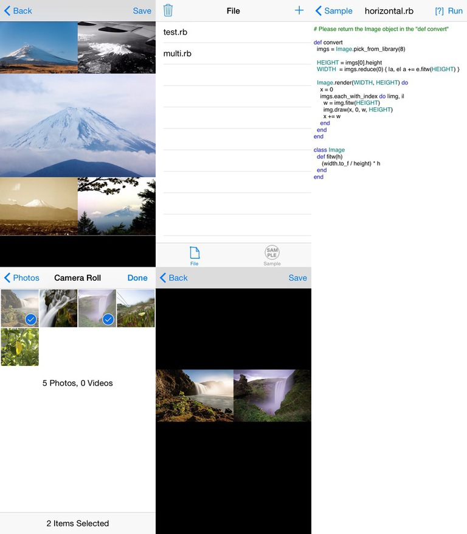

# PictRuby

Ruby Programming Environment in iOS. File Viewer, Editor and Execution Environment included.

- Automate the task
- Launch application
- Web API
- Calculation
- Image filter

Let's create a favorite program with Ruby!

## Installation

## Editor

## Link

- [GitHub](https://github.com/ongaeshi/PictRuby)
- [Gems](https://github.com/ongaeshi/PictRubyGems)

